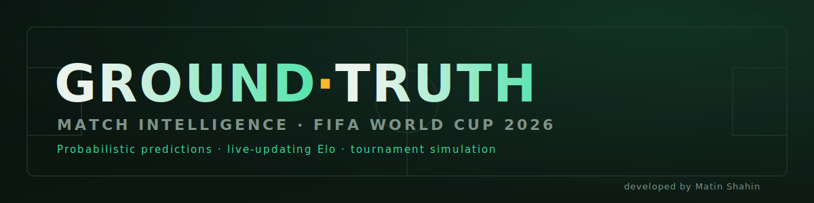

<p align="center">
  
</p>

<h1 align="center">GROUNDTRUTH</h1>

<p align="center">
  <b>Probabilistic match intelligence for the 2026 FIFA World Cup.</b><br>
  Calibrated win/draw/loss odds, expected goals, full match-stat projections,
  Monte-Carlo tournament simulation, and ratings that learn from real results.
</p>

<p align="center">
  
  
  
  
</p>

<p align="center">
  <a href="https://matinshahin.github.io/FIFA-World-Cup-2026/"><b>▶ Open the live app</b></a>
</p>

---

## Overview

**GROUNDTRUTH** is a self-contained football prediction engine for the 2026
World Cup. It runs entirely in the browser from a single HTML file, no install,
no account, no server, no tracking. Open it and it works.

It is built on the same statistical foundation used by professional and
bookmaker models: **Elo strength ratings → expected goals → a Poisson scoreline
distribution**. Every probability you see is read from one consistent model, and
the ratings update from real match results so predictions get sharper as the
tournament unfolds.

> **Honest by design.** No model predicts football with high accuracy on every
> match, outcomes carry real, irreducible randomness. GROUNDTRUTH targets the
> professional tier (roughly 55–65% on win/draw/loss, lower on exact scores) and
> always shows calibrated probabilities, never fake certainty.

## Features

| Tab | What it does |
|-----|--------------|
| **Predict** | Pick any two teams for win/draw/loss %, expected goals (xG), the most likely scorelines, a scoreline heatmap, over/under and both-teams-to-score, plus a full **match-statistics projection** (possession, shots, shots on target, corners, fouls, cards) and a written analyst read. |
| **Fixtures** | All **72 group-stage matches** from the official draw. Played games show the real full-time score and feed back into the ratings; upcoming games are predicted, and each group is simulated 5,000 times for qualification odds. |
| **Simulate** | Monte-Carlo knockout brackets, run 10,000 tournaments to estimate each team's title odds. |
| **Scout** | Turn qualitative team news (injuries, suspensions, rest, form) into a small, bounded Elo adjustment that flows into predictions. |
| **Ratings** | Official **World Football Elo** updater, enter a result and both teams recalculate automatically, or edit any rating by hand. |
| **Method** | A transparent, honest explanation of the math. |

## How it works

1. **Strength → Elo.** Each team carries a World Football Elo rating; a
   100-point gap means roughly a 64% win expectancy at a neutral venue.
2. **Elo → expected goals.** The rating gap becomes a goal *supremacy*; the
   divisor is calibrated so the goal model reproduces the Elo win expectancy.
3. **Expected goals → scorelines.** Goals are modelled as Poisson processes with
   a Dixon–Coles low-score correction. Win/draw/loss, scorelines, over/under and
   the rest are all read from this single matrix.
4. **Results → learning.** Actual full-time scores are folded back into Elo with
   the official formula (K-factor by importance, goal-difference index, home
   advantage), so the model self-corrects after every match day.
5. **Tournament → Monte Carlo.** The simulator samples goals from each team's
   Poisson, settles knockout draws on a lightly Elo-weighted shootout, and
   replays the bracket thousands of times.

A deeper write-up lives in **[METHODOLOGY.md](METHODOLOGY.md)**.

## Getting started

**Just use it:** open `index.html` in any browser (or visit the live link above).
Everything works offline. That's the whole requirement.

## Keeping it current

The model is strongest when fed real results. To refresh:

1. Open the app and add an **OpenRouter** API key in **Scout → Settings** (used
   only by you, stored only in your browser).
2. **Fixtures → Update results** pulls the latest finished scores and folds them
   into the ratings. Verify the scores look right.
3. **Fixtures → Export to share** downloads a fresh standalone file with the new
   results baked in.
4. Re-upload that file as `index.html` to refresh the live site for everyone.

> Your API key is **never** written into the exported/shared file.

## Project structure

```
index.html                 The entire app (this is all GitHub Pages needs)
README.md                  This file
METHODOLOGY.md             The model, explained in depth
banner.svg                 README banner
LICENSE                    MIT
server.py                  Optional: local results backend (football-data.org)
run_groundtruth.bat        Optional: open the app on Windows
run_groundtruth_live.bat   Optional: start the backend + open the app
```

## Tech

Vanilla HTML, CSS and JavaScript in one file. **Zero dependencies**, zero build
step, no frameworks. All computation (Elo, Poisson, Monte Carlo) runs locally in
the browser. Data persists in `localStorage`.

## Disclaimer

For entertainment and analysis. Predictions are statistical estimates, not
guarantees, and should not be used for betting decisions.

## License

Released under the [MIT License](LICENSE).

## Author

**Matin Shahin**: design, model, and implementation.

<p align="center"><sub>© 2026 Matin Shahin · Built with curiosity and a Poisson distribution.</sub></p>
